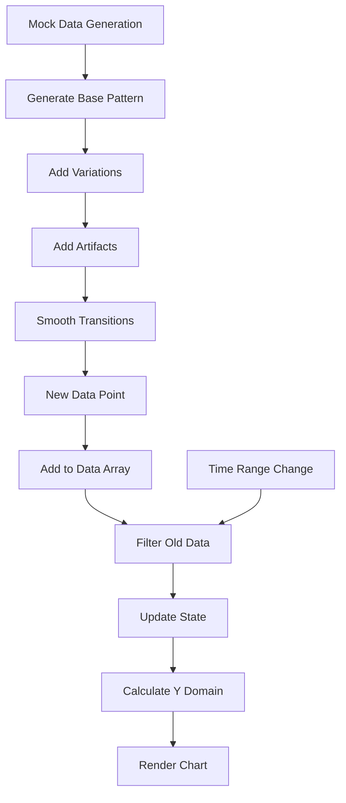

# EGG Monitor Improvement Plan

## Overview

This document outlines the plan for implementing three key improvements to the EGG Monitor project:

1. Make mock data generation more realistic
2. Clear data older than the current selected timerange
3. Fix the charts y-axis in the frontend

## 1. Make Mock Data Generation More Realistic

Currently, the mock data is generated with random values between -1 and 1, which doesn't reflect realistic EGG patterns. EGG signals typically have specific characteristics:

- They have a baseline rhythm (around 3 cycles per minute)
- They show gradual changes rather than completely random jumps
- They may include occasional artifacts or specific patterns

### Implementation Plan:

1. **Create a more sophisticated data generation algorithm:**
   - Implement a sine wave base pattern with small random variations
   - Add occasional artifacts to simulate real-world conditions
   - Ensure the data maintains physiologically realistic patterns

2. **Modify the data generation code in `frontend/app/page.js`:**
   - Replace the current random data generation with a more realistic algorithm
   - Add parameters to control the characteristics of the generated data
   - Ensure the data rate is respected for proper visualization

```javascript
// Pseudocode for improved data generation
const generateRealisticEGGData = (previousValue = 0, time) => {
  // Base sine wave (3 cycles per minute = 0.05Hz)
  const baseFrequency = 0.05;
  const baseAmplitude = 0.5;
  
  // Calculate base signal
  const baseSine = baseAmplitude * Math.sin(2 * Math.PI * baseFrequency * time);
  
  // Add small random variations (10% of amplitude)
  const noise = (Math.random() * 0.2) - 0.1;
  
  // Add occasional artifacts (5% chance)
  const artifact = Math.random() > 0.95 ? (Math.random() * 0.4) - 0.2 : 0;
  
  // Ensure smooth transitions from previous value
  const smoothingFactor = 0.7;
  const newValue = (smoothingFactor * previousValue) + ((1 - smoothingFactor) * (baseSine + noise + artifact));
  
  // Ensure value stays within -1 to 1 range
  return Math.max(-1, Math.min(1, newValue));
};
```

## 2. Clear Data Older Than Current Selected Timerange

Currently, there's some filtering of old data, but it might not be efficient if the data array grows too large over time. We need to ensure that:

- Only data within the selected timerange is kept in memory
- The filtering happens efficiently to prevent performance issues
- The chart only displays relevant data

### Implementation Plan:

1. **Improve data management in `frontend/app/page.js`:**
   - Modify the data storage to efficiently remove old data points
   - Ensure filtering happens before adding new data to prevent memory issues
   - Implement a more efficient data structure if needed

2. **Update the EggChart component:**
   - Ensure the chart only processes data within the timerange
   - Optimize rendering for large datasets
   - Add smooth transitions when data points are added/removed

```javascript
// Pseudocode for improved data management
const updateSensorData = (sensorId, newDataPoint, timeRange) => {
  setSensorData(prevData => {
    // Get current data array for this sensor
    const currentData = prevData[sensorId] || [];
    
    // Add new data point
    const updatedData = [...currentData, newDataPoint];
    
    // Current timestamp in seconds
    const now = Math.floor(Date.now() / 1000);
    
    // Filter to keep only data within timerange
    const filteredData = updatedData.filter(d => d.timestamp >= now - timeRange);
    
    return {
      ...prevData,
      [sensorId]: filteredData
    };
  });
};
```

## 3. Fix the Charts Y-Axis in the Frontend

Currently, the y-axis in the EggChart component is fixed with a domain of [-1, 1]. This might not be optimal for all data scenarios and could lead to visualization issues.

### Implementation Plan:

1. **Implement dynamic y-axis scaling:**
   - Calculate the min and max values from the actual data
   - Add padding to ensure data points don't touch the edges
   - Update the scale when new data arrives

2. **Add configuration options for y-axis:**
   - Allow setting min/max values as props
   - Provide option for auto-scaling
   - Add ability to lock the scale to prevent jumps

3. **Improve axis labels and grid:**
   - Add more informative tick marks
   - Ensure consistent spacing
   - Improve visual appearance

```javascript
// Pseudocode for dynamic y-axis scaling
const calculateYDomain = (data, padding = 0.1) => {
  if (!data || data.length === 0) return [-1, 1]; // Default domain
  
  // Find min and max values
  const minValue = Math.min(...data.map(d => d.value));
  const maxValue = Math.max(...data.map(d => d.value));
  
  // Calculate range
  const range = maxValue - minValue;
  
  // Add padding
  const paddingAmount = range * padding;
  
  // Return domain with padding
  return [
    Math.max(-1, minValue - paddingAmount), 
    Math.min(1, maxValue + paddingAmount)
  ];
};

// In the chart component
const yDomain = props.fixedYDomain || calculateYDomain(filteredData);
const yScale = d3.scaleLinear()
  .domain(yDomain)
  .range([innerHeight, 0]);
```

## Implementation Sequence

1. **First Phase: Improve Mock Data Generation**
   - Modify the data generation algorithm in frontend/app/page.js
   - Test with different parameters to ensure realistic patterns
   - Verify visualization looks more like actual EGG data

2. **Second Phase: Optimize Data Management**
   - Implement efficient data filtering in frontend/app/page.js
   - Update the EggChart component to handle data changes smoothly
   - Test with different timeranges to ensure proper functionality

3. **Third Phase: Fix Y-Axis Scaling**
   - Implement dynamic y-axis scaling in EggChart.js
   - Add configuration options for customization
   - Test with various data patterns to ensure proper visualization

4. **Testing and Validation**
   - Test performance with extended running time
   - Verify memory usage remains stable
   - Ensure visualization remains smooth and responsive
   - Validate y-axis behavior with different data patterns

## Technical Considerations

- **Performance Impact**: More complex data generation might increase CPU usage
- **Memory Management**: Efficient filtering is crucial to prevent memory leaks
- **Visual Consistency**: Ensure transitions between data points remain smooth
- **Responsiveness**: The UI should remain responsive even with frequent updates
- **Y-Axis Stability**: Prevent constant rescaling which could make the chart hard to read

## Visualization



## Next Steps

1. Switch to Code mode to implement these changes
2. Start with the mock data generation improvements
3. Implement the data filtering optimization
4. Fix the y-axis scaling
5. Test all components together